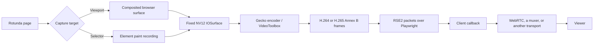

# Video streaming

Sometimes you need to stream browser content for debugging or let a user watch
and interact with a live browser session. These streams need high visual
quality and high frame rates: a lagging, blurry, or jerky browser is difficult
to debug and gives users a poor experience.

Existing browser automation interfaces are not built for this. Normal
Playwright APIs expose screenshots and file-oriented video recording, not a
low-latency stream of hardware-encoded frames. Stock automation browsers also
lack a direct compositor-to-encoder path, leaving clients to use screenshot
loops or image screencasts that trade resolution and frame rate for latency.

Rotunda introduces native video streaming for applications that need real-time
browser content at up to near-60 fps in 4K. It can stream a page viewport or one
DOM element as native H.264 or H.265 video without an intermediate PNG/JPEG
encode or client-side re-encode. Rotunda owns capture and encoding; your client
owns transport, playback, and viewer access. Actual throughput depends on
output size, capture mode, machine, and load; the architecture is designed to
approach 4K60 on the headed macOS compositor path.

Native video streaming currently requires macOS. For the older image-based
screencast path and an HLS player example, see [Live Screencast Stream](live-screencast-stream.md).

## Run the example

The complete [WebRTC example](../scripts/stream-selector-webrtc.py) forwards
Rotunda's encoded video without decoding or re-encoding it:

```bash
uv run scripts/stream-selector-webrtc.py \
  --url https://example.com \
  --video-size 1920x1080 \
  --fps 30 \
  --bitrate-mbps 12
```

The command prints a tokenized local viewer URL. Add `--selector '#preview'`
to stream the first matching element instead of the viewport. The script also
supports an existing Rotunda browser through `--endpoint`, remote ICE servers,
TLS, H.264 or H.265, and a built-in benchmark; run it with `--help` for the full
list.

## Architecture



For a headed viewport, Rotunda reads the already-composited Core Animation
layer tree, crops browser chrome, converts the result to an NV12 `IOSurface`,
and gives it to Gecko's platform encoder. Headless viewport capture uses a CPU
WebRender readback before the same native encoding stage.

A selector stream cannot read the full viewport without also exposing pixels
outside the selected element. Rotunda instead replays that element's paint into
an isolated surface, centers it on the fixed output canvas, and includes its
current content rectangle with every encoded frame. This selector path is more
CPU-bound than headed viewport capture.

The output dimensions never change during a stream. A resizing element changes
the content rectangle, not the decoder canvas, so clients do not need to rebuild
their decoder on every layout change. See [Native viewport and selector video](element-video-stream.md)
for implementation details and current performance measurements.

## Python API

The public helpers live in `rotunda.screencast`:

```python
from rotunda.screencast import (
    normalize_frame_data,
    start_video_stream,
    stop_video_stream,
)
```

`start_video_stream(page, on_frame, *, size, selector, fps, bitrate, codec)`
starts the stream. Its options are:

| Option | Default | Meaning |
| --- | --- | --- |
| `size` | `1280x720` | Fixed encoded width and height. Both must be even and between 2 and 8192. |
| `selector` | `None` | Stream the viewport, or the first matching DOM element. |
| `fps` | `25` | Target capture rate from 1 through 60. |
| `bitrate` | `12_000_000` | Target bits per second. |
| `codec` | `"h264"` | `"h264"` for broad compatibility or `"h265"` for greater efficiency when the viewer supports it. |

The helper is async, but `on_frame` is a normal callback. Each event contains a
`data` field; pass it through `normalize_frame_data()` because Playwright may
deliver it as bytes or base64 text.

```python
import asyncio

from playwright.async_api import async_playwright
from rotunda import AsyncNewBrowser
from rotunda.screencast import (
    normalize_frame_data,
    start_video_stream,
    stop_video_stream,
)


async def main() -> None:
    async with async_playwright() as playwright:
        browser = await AsyncNewBrowser(playwright)
        page = await browser.new_page()
        await page.goto("https://example.com")

        def on_frame(event: dict[str, object]) -> None:
            packet = normalize_frame_data(event["data"])
            media_transport.push(packet)  # Parse RSE2 and forward Annex B.

        try:
            await start_video_stream(
                page,
                on_frame,
                size={"width": 1920, "height": 1080},
                fps=30,
                bitrate=12_000_000,
                codec="h264",
            )
            await asyncio.Event().wait()
        finally:
            await stop_video_stream(page)
            await browser.close()


asyncio.run(main())
```

`media_transport` is deliberately the application boundary: use the WebRTC
example's [`NativeVideoTrack`](../scripts/stream-selector-webrtc.py) or replace
it with your own RTP packetizer, recorder, or muxer. Rotunda does not create a
viewer URL or choose a network protocol for you.

Only one image screencast or native video stream may run on a page at once.
Always call `stop_video_stream()` in `finally`; `page.screencast.stop()` controls
the separate image API and does not stop native video.

### Lower-level protocol

The Python helper installs a small Playwright driver extension and maps the
same lifecycle onto:

- `videoStreamStart` / `videoStreamStop` on Playwright's page channel.
- `Page.startVideoStream` / `Page.stopVideoStream` in Juggler.
- `Page.screencastFrame` events for delivery.

Most clients should use the Python helpers. The lower-level names matter when
implementing another language binding or connecting directly to Juggler.

## Packet format

A callback can contain more than one encoded frame. Each frame is an `RSE2`
header followed by one H.264 or H.265 Annex-B access unit:

```text
RSE2 | flags:u8 | size:u32be | pts_us:u64be | duration_us:u32be |
width:u32be | height:u32be | crop_x:u32be | crop_y:u32be |
crop_width:u32be | crop_height:u32be | Annex-B bytes
```

Bit 0 of `flags` marks a keyframe. `size` is the number of Annex-B bytes, and
all timestamps use microseconds. The crop rectangle identifies the pixels that
belong to the capture target inside the fixed `width` by `height` canvas. It is
the full canvas for viewport streams.

The example's [`parse_native_frames`](../scripts/stream-selector-webrtc.py)
is the reference parser. It preserves presentation timestamps, sends the
Annex-B bytes through RTP/SRTP, and carries crop changes on a WebRTC data
channel so the viewer can present only the selected element.

## What clients must do

Rotunda deliberately stops at the encoded-frame boundary. A production client
is responsible for:

- Choosing a delivery protocol. WebRTC is the usual low-latency choice; a
  recorder may instead mux the access units into MP4 or another container.
- Preserving `pts_us`, `duration_us`, the keyframe flag, and codec identity when
  packetizing or muxing frames.
- Keeping the callback fast. Queue bounded work off the callback and prefer
  dropping stale video to growing latency without bound. After dropping a
  dependency chain, wait for the next keyframe before resuming; Rotunda requests
  a keyframe about once per second.
- Applying the crop rectangle when streaming a selector. Do not resize the
  decoder every time the element changes size.
- Handling codec negotiation. H.264 has the widest browser support. Use H.265
  only when every intended viewer advertises it.
- Supplying authentication, HTTPS, and appropriate STUN/TURN servers when the
  viewer is not strictly local. The example refuses a non-loopback listener
  without a certificate and protects viewer and offer endpoints with a random
  token.
- Monitoring disconnects, packet loss, queue depth, and end-to-end latency.
  Restart the stream after resolving the selector again if the captured element
  is detached and capture stops.

The example already implements these responsibilities for one live viewer. If
you need fan-out, recording, adaptive bitrate, or a managed media service, put
that behind the same encoded-frame boundary instead of adding another capture
or encode pass.
